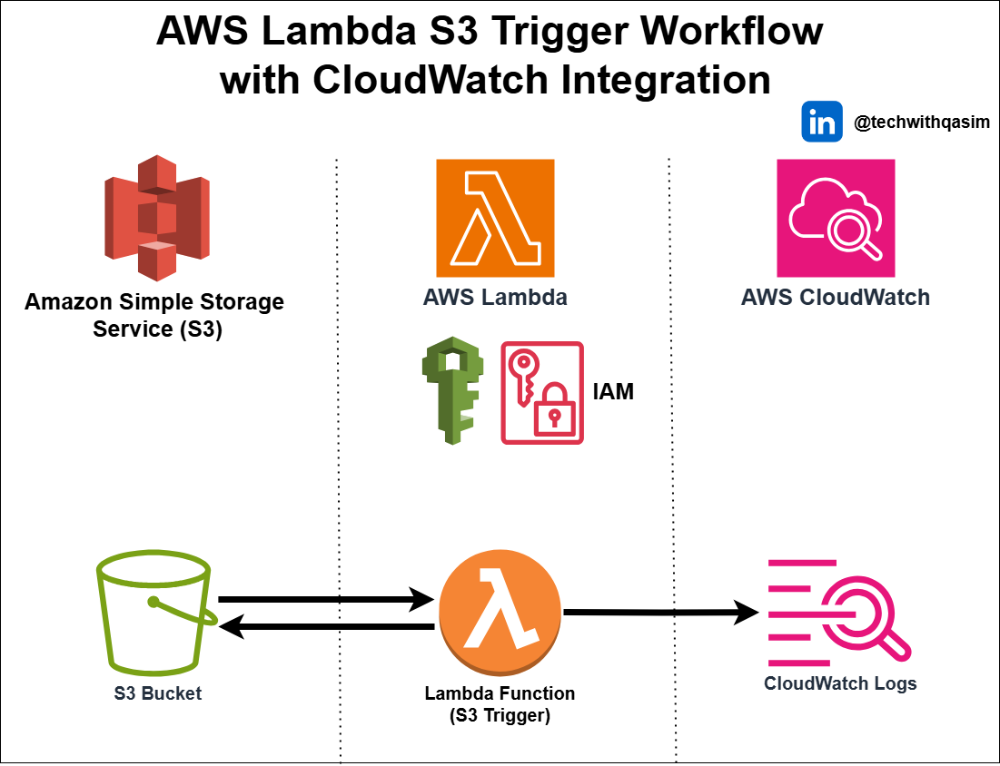

# AWS Lambda S3 Trigger with CloudWatch Integration

This project demonstrates how to set up an AWS Lambda function triggered by Amazon S3 events, with logs seamlessly integrated into AWS CloudWatch. The architecture automates data processing workflows, ensuring scalability, cost efficiency, and real-time monitoring.

#### **Key Features:**
Event-Driven Execution – Lambda triggers on S3 file uploads.
Real-Time Monitoring – Logs sent to CloudWatch for tracking and debugging.
Secure Access Control – IAM roles manage permissions for Lambda and S3.
Serverless & Scalable – Automatically scales with incoming S3 events.

#### **Use Cases:**
Real-time file processing
Data pipeline automation
Media transformation
Security logging and compliance

Perfect for developers looking to automate workflows and improve observability in their AWS environment.